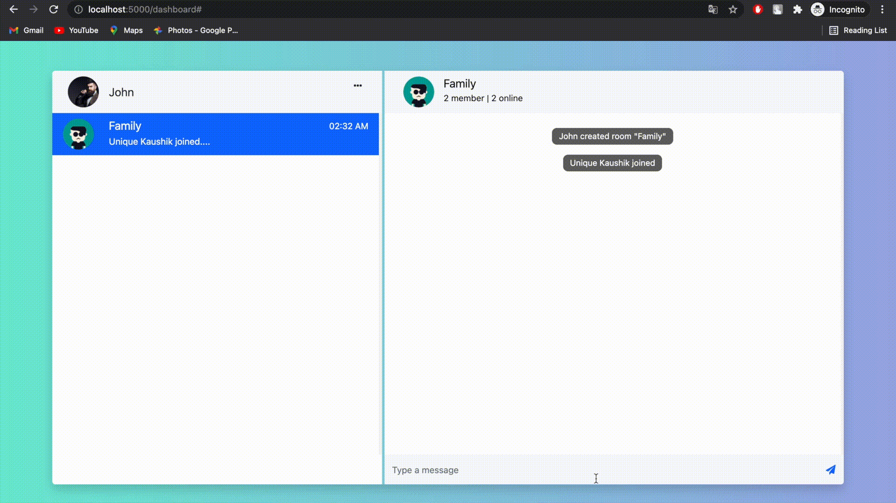

# JusTalk

This is a chat application built using Node.js, Express, Passport, Mongoose, EJS, Multer, passport-google-oauth20 and some other packages. A user can login with email/password 
or with google. After logging in we can create or join rooms and chat with anyone.

## Usage

Install all packages using
```bash
npm install
```

Create a .env file and add these variables in it: 
* MONGO_URI
* GOOGLE_CLIENT_ID
* GOOGLE_CLIENT_SECRET

```bash
npm start
# or run with nodemon
npm run dev

# Visit http://localhost:5000
```

## Deployed at
[justalkme.herokuapp.com](http://justalkme.herokuapp.com)

### Some Screenshots

Logging in with email password and creating room


Logging in with Google and joining a room


Chatting

